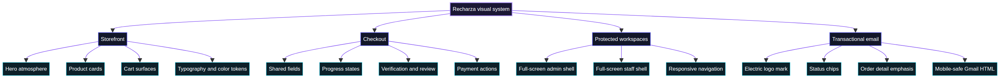

# Recharza Platform
## UI & Transactional Email Styling Summary

**Prepared by:** Manus AI  
**Scope:** Storefront, purchase flow, account surfaces, protected workspaces, and Gmail transactional notifications  
**Status:** Local redesign work reviewed and build-verified; deployment status is identified per section below.

> Recharza’s visual direction has been consolidated into a premium dark interface built around indigo-violet atmosphere, restrained cyan/magenta accents, high-contrast typography, fluid full-screen layouts, and operationally clear purchase states.

*Figure 1. Visual coverage of the styling updates across storefront, checkout, protected workspaces, and transactional email.*

## Executive visual summary

The platform’s styling work moved from isolated dark panels and one-off violet values toward a shared design language. The storefront now has richer atmospheric backgrounds, stronger product merchandising, clearer CTA hierarchy, and more expressive card surfaces. Cart and checkout surfaces use the same semantic treatment as the homepage, while game-specific flows inherit shared tokens for fields, progress, verification, payment, and review states.

The internal workspaces were also standardized around a full-screen responsive shell. Admin and staff routes now use fluid content regions with a stable desktop navigation model and full-width mobile behavior. The live browser check confirmed that the deployed site was still serving the pre-patch admin shell at the time of testing; the local patch is ready but requires deployment before the live visual test can be repeated.

Transactional email received a parallel brand treatment. Account, security, completed-order, and failed-order messages now use the authentic electric Recharza mark, a restrained status chip, compact detail tables, accent-emphasized amounts, a branded violet CTA, mobile-safe typography, and a consistent security footer. Gmail delivery was independently confirmed in production, with the test message arriving successfully in Spam.

## Design system at a glance

| Layer | Updated direction | Representative implementation |
|---|---|---|
| Core atmosphere | Indigo-violet depth with cyan and magenta light accents | `app/globals.css`, `app/storefront-redesign.css` |
| Surfaces | Layered gradients, subtle borders, inset highlights, controlled elevation | Shared panel and card classes |
| Typography | Stronger heading contrast, calmer body copy, professional system font stack, improved tracking | Global CSS and transactional email renderer |
| Actions | Violet primary CTA, readable secondary actions, clearer focus and hover states | Homepage, cart, checkout, email CTA |
| Product merchandising | Richer image framing, clearer game identity, stronger price emphasis, selective badges | `components/game-card.tsx` |
| Checkout semantics | Shared field, panel, progress, alert, primary-action, and secondary-action tokens | `app/globals.css`, supplier and Mobile Legends shells |
| Brand mark | Authentic electric Recharza line mark instead of a plain letter badge | `components/recharza-mark.tsx`, email logo asset |
| Responsive shell | Full-width roots, fluid content, desktop sidebar, mobile navigation strip | Admin/staff page shells and workspace components |

## Storefront and homepage

### Hero section

The homepage hero was refined to act as a brand statement and a conversion surface at the same time. Layered violet and cyan lighting adds depth behind the artwork, the headline uses a stronger branded gradient and restrained glow, and the right-side console has a clearer surface edge and inset highlight so it reads as a purposeful product feature rather than a decorative card.

### Product cards

The game-card system now gives the artwork more presence without letting it overpower the product identity. Image framing is clearer, saturation and hover brightness are controlled, the game label and title are easier to scan, and the price has a stronger secondary hierarchy. The action footer now carries a premium violet treatment and clearer interaction feedback.

| Homepage surface | Visual change | Commerce behavior |
|---|---|---|
| Hero artwork | Richer atmospheric lighting and stronger visual anchor | Preserved |
| Hero headline | Higher contrast gradient treatment and balanced scale | Preserved |
| Hero console | Deeper surface, clearer border, stronger inset highlight | Preserved |
| Game image frame | More deliberate crop and hover treatment | Preserved |
| Game identity | Clearer label/title hierarchy | Preserved |
| Price | Stronger emphasis as the key secondary decision point | Preserved |
| Card CTA | Violet elevated action with hover feedback | Preserved |

## Cart and checkout

The cart and order summary now match the homepage’s layered indigo-violet surface language. Empty, loading, active, and summary states were all refined so the cart does not feel like a separate product. Totals are more legible, the primary checkout CTA has clearer emphasis, and secondary actions use the same radius, weight, and interaction rules as the storefront.

Game-specific checkout flows were then standardized with shared semantic tokens. Supplier and Mobile Legends shells now use consistent fields, progress navigation, verification actions, review panels, payment actions, and step controls. Existing player verification, package selection, pricing, payment, idempotency, and order-creation behavior was preserved.

## Protected workspaces

The admin and staff shells were audited for width constraints and standardization. The local patch removes the old centered max-width behavior, adds full-width roots, keeps the content column fluid, and establishes a stable 16rem desktop sidebar with responsive mobile navigation behavior. Operator routing was confirmed as a redirect into admin/staff order surfaces rather than a separate shell.

| Workspace | Local status | Main result |
|---|---|---|
| `/admin` | Patched and build-verified | Full-width root, fluid content, stable desktop navigation |
| `/staff` | Patched and build-verified | Matches the admin shell and responsive spacing |
| `/operator` | Audited | Redirects into internal order surfaces; no duplicate layout |
| `/account/orders` | Audited | Remains customer-facing and separate from internal workspaces |
| Shared header/navigation | Patched | Full viewport header and responsive navigation behavior |

> **Live verification note:** the authenticated production browser test still displayed the old constrained admin shell, proving that the local full-screen patch had not yet been deployed at the time of inspection.

## Transactional Gmail notifications

The email system now follows the same premium visual logic as the storefront while remaining compatible with Gmail’s HTML rendering constraints. The authentic electric logo is used through the hosted brand asset, and the renderer continues to escape dynamic values and action URLs.

| Email element | Updated treatment |
|---|---|
| Header | Authentic electric Recharza mark, wordmark, and `PLAY · PAY · DELIVERED` tagline |
| Status | Accent-aware compact status chip for account, security, completed, and failed states |
| Message hero | Indigo-violet gradient surface with a restrained status accent |
| Details | Compact table with stronger amount/total emphasis and readable labels |
| CTA | Branded violet button with controlled elevation |
| Security | Persistent warning against password, OTP, PIN, and remote-device requests |
| Footer | Support address, automated-message explanation, and trademark note |
| Mobile | 640px responsive rules, smaller title, tighter padding, hidden nonessential metadata |

The order-specific builders in `lib/order-email.ts` preserve the existing completed and failed order fields, amounts, player identity, package name, reason, timestamps, and encoded tracking URLs. They continue to send through the shared renderer in `lib/transactional-email.ts`.

## Verification and release status

| Check | Result |
|---|---|
| TypeScript | Passed across the reviewed UI and email changes |
| Lint | Passed with 17 existing warnings and no errors |
| Whitespace safety | `git diff --check` passed |
| Production build | Completed successfully with all routes generated |
| Local DB warnings | Expected in sandbox because database environment variables are unavailable |
| Gmail delivery | Confirmed; test email reached the recipient, with Spam placement noted |
| Checkout batch migration | Applied and verified in Neon; column and index both returned true |
| Live admin visual test | Exposed that production still served the pre-patch constrained shell |
| Deployment state | The collected styling patches remain local unless separately committed and deployed |

## Change coverage by file family

| File family | Role in the styling work |
|---|---|
| `app/globals.css` | Global tokens, surfaces, typography, inputs, checkout semantics, and homepage depth |
| `app/storefront-redesign.css` | Hero, popular rail, card contrast, and homepage interaction treatment |
| `components/game-card.tsx` | Product imagery, game identity, pricing, and card CTA hierarchy |
| `components/cart-page.tsx` | Cart loading, empty, active, and responsive states |
| `components/cart-order-summary.tsx` | Summary surfaces, totals, and checkout action treatment |
| `components/supplier-game-checkout-shell.tsx` | Shared supplier-flow field, progress, review, and payment styling |
| `components/mobile-legends-checkout-shell.tsx` | Mobile Legends verification, progress, and step-control styling |
| `app/admin/page.tsx` | Full-screen admin shell |
| `app/staff/page.tsx` | Full-screen staff shell |
| `components/workspace-navigation.tsx` | Responsive sidebar/navigation behavior |
| `components/internal-header.tsx` | Full-width workspace header |
| `lib/transactional-email.ts` | Shared branded email renderer and account/security messages |
| `lib/order-email.ts` | Completed and failed order notification builders |

## Recommended release sequence

The styling work is organized so it can be released as a focused visual patch without changing commerce logic. The recommended sequence is to review the local visual diff, commit the storefront, workspace, checkout, and email changes as an intentionally scoped release, deploy to a preview environment, inspect the homepage, cart, checkout, admin, and email preview, and then promote the verified build to production. The admin visual test should be repeated after deployment because the live site was confirmed to be serving the previous constrained shell.

## Final assessment

The platform now has a substantially more coherent visual foundation: the homepage, cart, checkout, protected workspaces, and Gmail notifications share the same surface depth, accent discipline, typography hierarchy, and responsive intent. The remaining gap is release propagation rather than design coverage: the local patches need to be committed and deployed before the live storefront and admin route can display the complete system.

### Evidence sources

The summary is based on the reviewed repository files and verification records listed below.

| Reference | Repository evidence |
|---|---|
| R1 | `app/globals.css` |
| R2 | `app/storefront-redesign.css` |
| R3 | `components/game-card.tsx` |
| R4 | `components/cart-page.tsx` and `components/cart-order-summary.tsx` |
| R5 | `components/supplier-game-checkout-shell.tsx` and `components/mobile-legends-checkout-shell.tsx` |
| R6 | `app/admin/page.tsx`, `app/staff/page.tsx`, `components/workspace-navigation.tsx`, `components/internal-header.tsx` |
| R7 | `lib/transactional-email.ts` and `lib/order-email.ts` |
| R8 | `.agent-notes-live-email-diagnosis.md` and `.agent-notes-live-responsive-admin.md` |
